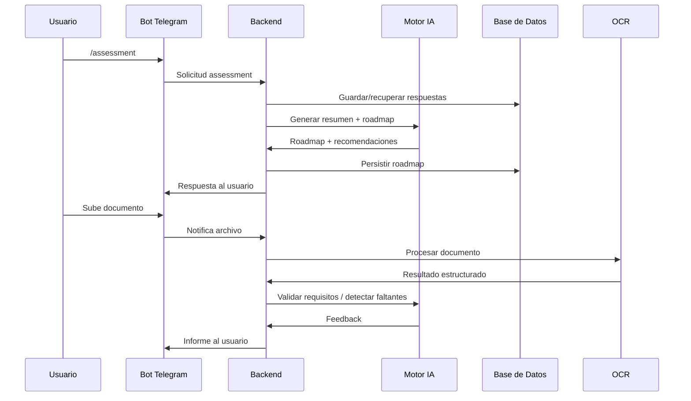
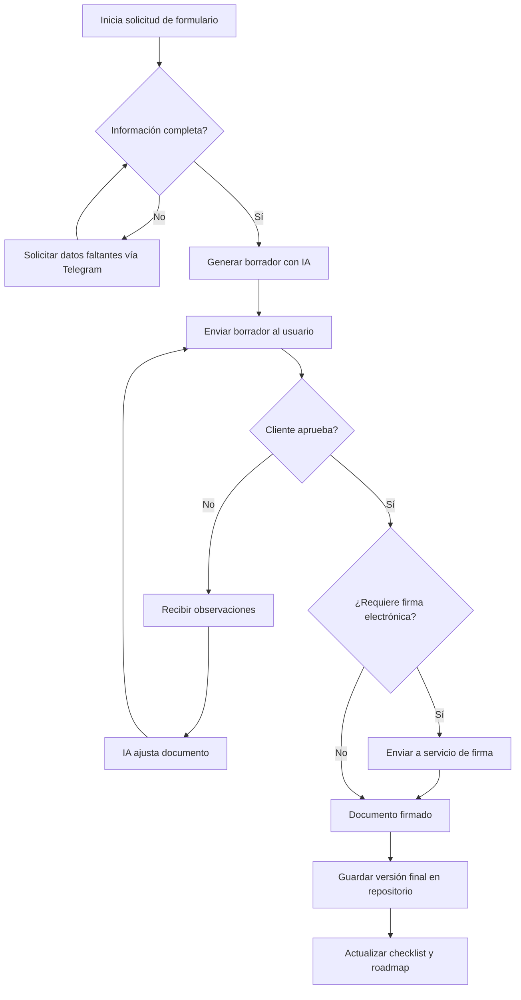
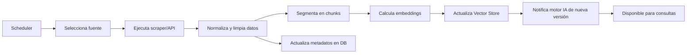

# MigPAL MVP – Diagramas Técnicos

## 1. Diagrama de Contenedores (C4 N3)
```mermaid
graph TD
    subgraph Client Layer
        TG[Usuario en Telegram]
        Admin[Administrador Web]
    end

    subgraph Backend Layer
        BOT[Servicio Bot Telegram]
        API[Backend Orquestador FastAPI]
        IA[Motor IA (Ollama + Tools)]
        SCR[Workers Scraping / RAG]
        OCR[Servicio OCR]
        FORM[Generador Formularios & Firma]
        SCORE[Motor Probabilidad]
        SIM[Motor Simulaciones]
        PANEL[Frontend Admin]
    end

    subgraph Data Layer
        DB[(PostgreSQL)]
        VEC[(Vector Store)]
        FILES[(Almacenamiento S3-Compatible)]
        LOGS[(Observabilidad)]
    end

    TG <--> BOT
    BOT <--> API
    Admin <--> PANEL
    PANEL <--> API

    API --> IA
    API --> OCR
    API --> FORM
    API --> SCORE
    API --> SIM

    IA --> VEC
    SCR --> VEC
    SCR --> DB

    API --> DB
    API --> FILES
    OCR --> FILES
    FORM --> FILES

    API --> LOGS
    SCR --> LOGS
    BOT --> LOGS
```

## 2. Flujo de Interacción en Telegram


## 3. Flujo BPMN (Generación y Firma de Formularios)


## 4. Flujo de Actualización de Conocimiento (Scraping + RAG)

```
